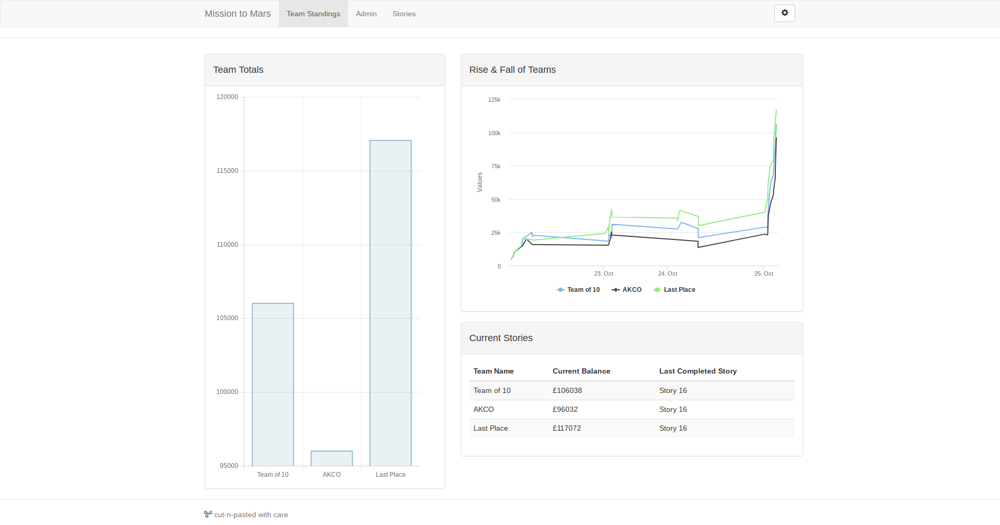

# Mission to Mars: October 2018 - Liskeard
Code created by the three teams at the Autumn 2018 outing for the Mission to Mars program, hosted at the RIO office in Liskeard. Students were given the support of a team of mentors from local education and businesses and tasked to complete the provided manoeuvrability challenges.

## Results
The challenges come with a Core Coin reward, with the prizes being totted up via
the teams dashboard.

The results were:

1. Last Place - $117,072
2. Team of 10 - $106,038
3. AKCO       - $96,032

## Usage Instructions
Clone the project locally and check out the various .ino files.
